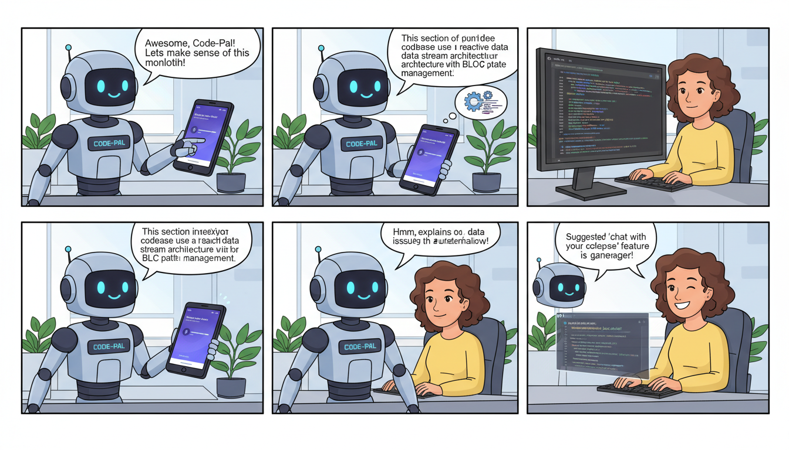

# 🤖 GitHub RAG Bot App

[](https://flutter.dev/)
[](https://firebase.google.com/)
[](https://opensource.org/licenses/MIT)

An intelligent mobile assistant built with **Flutter** that leverages **Retrieval-Augmented Generation (RAG)** to allow users to "chat" with GitHub repositories. Simply provide a repository URL, and the bot will index the codebase, documentation, and issues to provide context-aware answers to your technical questions.

---

## ✨ Features

-   **Repository Indexing:** Enter any public GitHub URL to sync and index its contents.
-   **Contextual Chat:** Ask complex questions about the codebase (e.g., "How is authentication handled?" or "Explain the logic in `auth_service.dart`").
-   **Code Snippet Generation:** The bot can generate code based on the specific patterns and styles found within the repository.
-   **Multi-Platform:** Runs seamlessly on **Android** and **iOS**.
-   **Firebase Integration:** Secure backend services for user authentication and history sync.
-   **Hybrid Search:** Combines semantic search with traditional keyword matching for highly accurate retrievals.

---

## 🏗️ Architecture

The app follows a standard RAG pipeline optimized for mobile performance:

1.  **Ingestion:** Fetches code via GitHub API.
2.  **Chunking:** Splits source code and Markdown into manageable segments.
3.  **Embedding:** Converts text into vector embeddings (via OpenAI/Gemini/Cohere).
4.  **Retrieval:** Searches a vector database for relevant code snippets based on user queries.
5.  **Generation:** Passes the context to a Large Language Model (LLM) to generate a precise response.

---

## 🚀 Getting Started

### Prerequisites

-   [Flutter SDK](https://docs.flutter.dev/get-started/install) (latest stable version)
-   [Dart SDK](https://dart.dev/get-dart)
-   GitHub Personal Access Token (for higher API rate limits)
-   An LLM API Key (OpenAI, Anthropic, or Gemini)

### Installation

1.  **Clone the repository:**
    ```bash
    git clone https://github.com/your-username/github-rag-bot-app.git
    cd github-rag-bot-app
    ```

2.  **Install dependencies:**
    ```bash
    flutter pub get
    ```

3.  **Environment Setup:**
    Create a `.env` file in the root directory (using the existing `.env` template):
    ```env
    GITHUB_TOKEN=your_github_pat_here
    LLM_API_KEY=your_api_key_here
    VECTOR_DB_URL=your_vector_db_endpoint
    ```

4.  **Firebase Configuration:**
    Ensure you have the `firebase_options.dart` file generated via FlutterFire CLI or manually configure the `google-services.json` (Android) and `GoogleService-Info.plist` (iOS).

5.  **Run the app:**
    ```bash
    flutter run
    ```

---

## 🛠️ Usage Example

### Chatting with a Repository

Once the app is running, navigate to the "Connect" screen:

1.  Paste a URL: `https://github.com/flutter/flutter`
2.  Wait for the status to change from **Indexing** to **Ready**.
3.  Ask a question:
    > "How does the `InheritedWidget` update its listeners in this repo?"

### Code Sample (RAG Prompting)

The internal logic uses a structured prompt to ensure the LLM stays grounded in the retrieved code:

```dart
String generateRAGPrompt(String query, List<String> contextSnippets) {
  return """
  You are an expert developer assistant. Use the following snippets from the GitHub repository to answer the user's question.
  
  Context:
  ${contextSnippets.join("\n---\n")}
  
  Question: $query
  
  Answer the question accurately based ONLY on the context above. If the answer isn't in the context, say you don't know.
  """;
}
```

---

## 📂 Project Structure

-   `lib/` - Core Flutter application logic.
    -   `models/` - Data structures for Repos and Messages.
    -   `services/` - GitHub API, LLM, and Vector DB integrations.
    -   `screens/` - UI layers (Home, Chat, Settings).
-   `android/` & `ios/` - Platform-specific configurations.
-   `analysis_options.yaml` - Linting rules for clean code.

---

## 🤝 Contributing

Contributions are welcome! Please follow these steps:

1.  Fork the Project.
2.  Create your Feature Branch (`git checkout -b feature/AmazingFeature`).
3.  Commit your Changes (`git commit -m 'Add some AmazingFeature'`).
4.  Push to the Branch (`git push origin feature/AmazingFeature`).
5.  Open a Pull Request.

---

## 📄 License

Distributed under the MIT License. See `LICENSE` for more information.

---

## 📬 Contact

Project Link: [https://github.com/your-username/github-rag-bot-app](https://github.com/your-username/github-rag-bot-app)